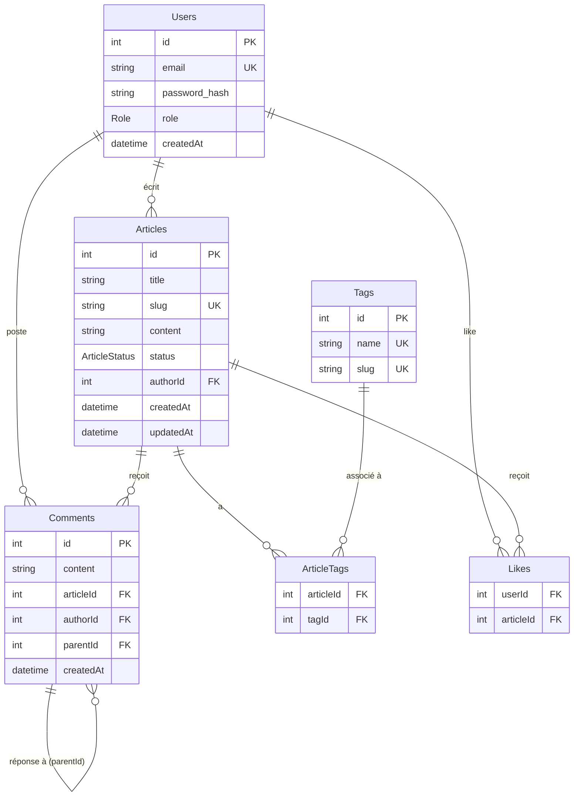

# Schéma de base de données

## Diagramme ER

## Enums

### `Role`
| Valeur | Description |
|---|---|
| `AUTHOR` | Peut créer/modifier/supprimer ses propres articles et commentaires |
| `MODERATOR` | Peut modifier/supprimer les articles et commentaires de tous les auteurs |
| `ADMIN` | Accès total, peut créer des tags |

### `ArticleStatus`
| Valeur | Description |
|---|---|
| `DRAFT` | Brouillon — visible uniquement par l'auteur |
| `PUBLISHED` | Publié — visible par tous |
| `DELETED` | Soft-deleted — jamais supprimé physiquement |

## Notes

- **Soft delete** : les articles ne sont jamais supprimés de la DB. Le statut passe à `DELETED`. Voir [ADR-003](adr/003-soft-delete.md).
- **Commentaires imbriqués** : la relation auto-référentielle `Comments.parentId → Comments.id` supporte un arbre de réponses. La suppression en cascade est gérée au niveau DB (`ON DELETE CASCADE`).
- **Clés composites** : `ArticleTags` et `Likes` utilisent des clés primaires composites (`articleId + tagId`, `userId + articleId`) pour garantir l'unicité sans colonne `id` séparée.
